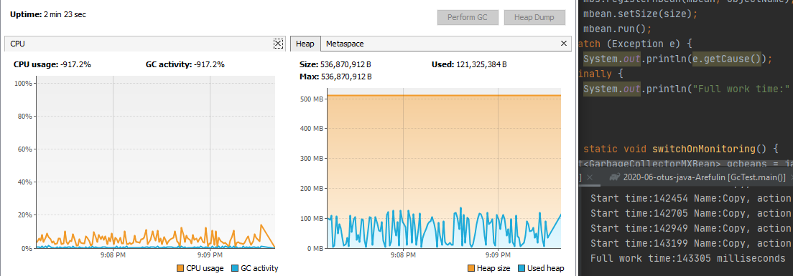
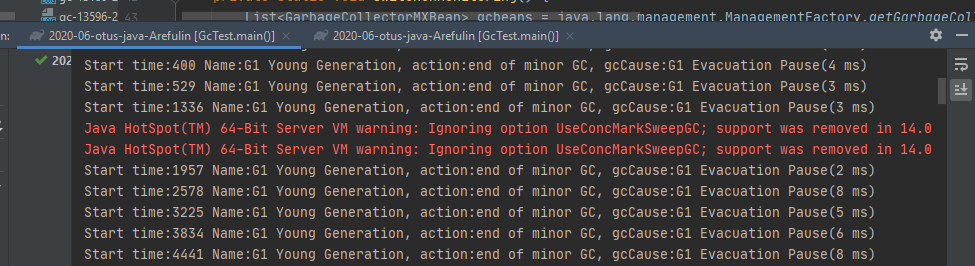

#Задача: 
Уменьшить время выполнения исходной программы за счёт подбора GC.

#Условия: 
Размер кучи: -Xms512m -Xmx512m

#Результат применения GC:

###-XX:+UseSerialGC
Небольшой размер рабочего листа size = 5 * 1000 (loopCounter = 20000).

Worked time: 222 340 ms

Большой размер рабочего листа size = 500 * 1000 (loopCounter = 10000)

Program execution time:      143 305 ms

Total number of cleanings:   559

Average cleaning time:       10 (ms)

Maximum cleaning time:       29 (ms)

###-XX:+UseParallelGC
Небольшой размер рабочего листа size = 5 * 1000 (loopCounter = 20000)

Worked time: 222 082 ms

Большой размер рабочего листа size = 500 * 1000 (loopCounter = 10000)

Program execution time:      139 038 (ms)

Total number of cleanings:   509

Average cleaning time:       17 (ms)

Maximum cleaning time:       46 (ms)

###-XX:+UseConcMarkSweepGC
Worked time: NO_DATA

CMS не поддерживается Java 14.
 
Производится автозамена GC на G1GC.

###-XX:+UseG1GC
Небольшой размер рабочего листа size = 5 * 1000 (loopCounter = 20000)

Worked time: 225 685 ms

Большой размер рабочего листа size = 500 * 1000 (loopCounter = 10000)

Program execution time:      164 357 (ms)

Total number of cleanings:   253

Average cleaning time:       3 (ms) 

Maximum cleaning time:       13 (ms)
 

###Выводы:

При сравнении результатов при малых нагрузках (небольшом размере рабочего листа size = 5 * 1000)
    
    GC показали незначительную разницу во времени выполнения программы.
    
    ParallelGC -> 222 082 ms
    
    SerialGC   -> 222 340 ms (+ 000 258 ms)
    
    G1GC       -> 225 685 ms (+ 003 603 ms)
    
    В лидерах ParallelGC. Однако, следует отметить, что ParallelGC дает значительную нагрузку на процессор (max до 12.5%) по 
    сравнению с SerialGC (max 0.1%).

При сравнении результатов при высоких нагрузках (большом размере рабочего листа size = 500 * 1000)
    
    GC показали уже значительную разницу во времени выполнения программы.
    
    ParallelGC -> 139 038 ms 
    
    SerialGC   -> 143 305 ms (+ 004 267 ms)
    
    G1GC       -> 164 357 ms (+ 025 319 ms) (!)
    
    В безусловных лидерах ParallelGC. G1GC используемый в IDEA по умолчанию показал себя совсем плохо. 

#Результат:
    
|GC|Low load (ms)|High load (ms)| Cleanings| Average time (ms)|Max time (ms)|
|:------------- |:---------------:| -------------:| -------------:|-------------:|-------------:|
| SerialGC|222340|143305|559|10|29|
| ParallelGC|222082|139038|509|17|46|
| g1GC |225685|164357|253|3|13|
| CMS |none|||||
  
  Из таблицы видно, что для решения поставленной задачи следует выбрать ParallelGC.